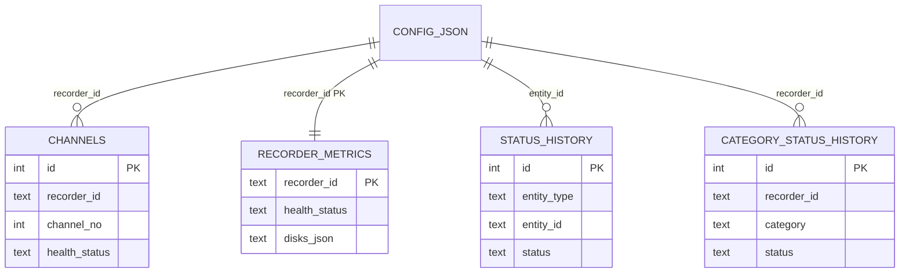
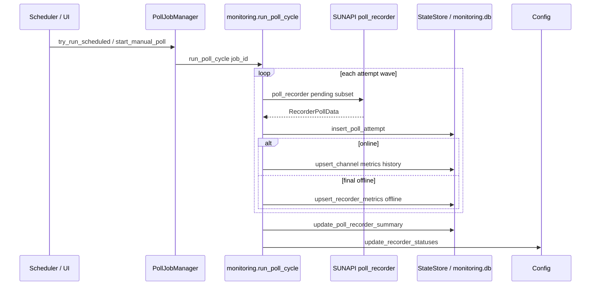

# База данных `monitoring.db`

Документ описывает схему SQLite-базы оперативного мониторинга проекта **Wisenet Диагностика**. База хранит результаты опросов NVR (регистраторов) и каналов по SUNAPI, агрегированное «здоровье» и историю изменений статусов. Предназначен для разработки, отладки и интеграции с LLM (запросы к данным, контекст для диагностики).

---

## 1. Общие сведения

| Параметр | Значение |
|----------|----------|
| СУБД | SQLite 3 |
| Файл по умолчанию | `{корень_проекта}/data/monitoring.db` |
| Переменная окружения | `STATE_DB_PATH` — полный путь к файлу БД |
| Модуль доступа | `backend/app/state_store.py` — класс `StateStore` |
| Инициализация схемы | `StateStore.init_db()` при первом обращении (`get_state_store()` в FastAPI) |
| Миграции | Добавление колонок через `ALTER TABLE` в `_migrate_schema()` (без отдельной таблицы версий) |

### 1.1. Что хранится в БД и что — нет

**В `monitoring.db`:**

- Текущее состояние каждого канала (`channels`).
- Снимок метрик по каждому регистратору (`recorder_metrics`).
- История смены агрегированного статуса канала/регистратора (`status_history`).
- История смены статуса по категориям здоровья (`category_status_history`).
- Журнал попыток опроса в рамках массового job (`recorder_poll_attempts`).
- Журнал импортов исходных файлов (`source_imports`).
- Выгрузка заявок Naumen (`naumen_records`).

**Не в БД (смежные хранилища):**

| Данные | Где |
|--------|-----|
| Список регистраторов, хост, порт, `object_name`, `enabled` | `config.json` (`ConfigStore`) |
| Краткий статус доступности (`online`/`offline`), `last_check_at`, `last_error` | `config.json`, поля `Recorder` |
| Учётные данные API | `config.json` → `credentials` |
| Пороги мониторинга (архив, NTP, температура) | `config.json` → `monitoring` |
| Прогресс фонового опроса (job id, percent) | Память процесса (`PollJobManager`), не персистентно |

Связь с конфигом: поле `recorder_id` во всех таблицах соответствует `recorders[].id` в `config.json` (формат `nvr-{8 hex символов}` при создании через UI).

### 1.2. Диаграмма связей (логическая)



Явных `FOREIGN KEY` в SQLite-схеме нет — целостность обеспечивается кодом приложения.

### 1.3. Соглашения о типах и значениях

| Соглашение | Описание |
|------------|----------|
| Время | Колонки `*_at`, `recorded_at`, `last_polled_at` — **TEXT**, ISO 8601 с timezone, обычно UTC (`datetime.now(timezone.utc).isoformat()`) |
| Логические | SQLite `INTEGER`: `0` = false, `1` = true, `NULL` = неизвестно |
| Статус здоровья | Строки: `ok`, `warn`, `error`, `unknown` (enum `HealthStatus` в `health.py`) |
| JSON | Поля `disks_json`, `system_events_json` — сериализованный JSON в TEXT (UTF-8, `ensure_ascii=False`) |
| Upsert | `channels`: `ON CONFLICT(recorder_id, channel_no)`; `recorder_metrics`: `ON CONFLICT(recorder_id)` |

---

## 2. Таблица `channels`

### 2.1. Назначение

Хранит **текущее** состояние каждого видеоканала на каждом регистраторе: инвентарные данные с NVR, признаки событий (VideoLoss, подключение), оценку здоровья и глубину архива записи по каналу. Одна строка = один канал (`recorder_id` + `channel_no`).

### 2.2. Поля

| Поле | Тип SQLite | NULL | По умолчанию | Назначение |
|------|------------|------|--------------|------------|
| `id` | `INTEGER` | NO | AUTO | Суррогатный первичный ключ (автоинкремент). Внутренний идентификатор строки; не привязан к устройству и может меняться при пересоздании канала |
| `recorder_id` | `TEXT` | NO | — | ID регистратора-владельца канала из `config.json` (`recorders[].id`, формат `nvr-{8 hex}`). Связь с конфигом и со всеми остальными таблицами |
| `channel_no` | `INTEGER` | NO | — | Номер канала на NVR (**0-based**, как в SUNAPI). Вместе с `recorder_id` образует бизнес-ключ канала |
| `name` | `TEXT` | YES | — | Отображаемое имя канала (`ChannelInfo.name`), заданное на NVR. `NULL`, если имя не получено |
| `camera_ip` | `TEXT` | YES | — | IP сетевой камеры канала. `NULL` для аналоговых каналов и пустых слотов; используется как признак «канал с IP-камерой» при оценке здоровья |
| `camera_model` | `TEXT` | YES | — | Модель камеры из атрибутов канала. `NULL`, если NVR не сообщил модель |
| `source_state` | `TEXT` | YES | — | Состояние источника с NVR в исходном регистре API: `On`, `Off`, `Deactive`, `Covert1`, `Covert2` и т.д. (сравнение в коде через `.lower()`). Базовый вход для `evaluate_channel_health` |
| `health_status` | `TEXT` | NO | `'unknown'` | Агрегированный статус канала: `ok` / `warn` / `error` / `unknown`. Вычисляется при каждом успешном обновлении (см. §2.4) |
| `health_reason` | `TEXT` | YES | — | Человекочитаемое объяснение текущего статуса (русский текст из `evaluate_channel_health`), напр. «Потеря видео (VideoLoss)», «Нулевой битрейт потока» |
| `video_loss` | `INTEGER` | YES | — | Признак события VideoLoss: `1` — активно (нет сигнала с камеры), `0` — нет, `NULL` — событие не опрашивалось в этом цикле |
| `last_polled_at` | `TEXT` | YES | — | Время последнего обновления строки, ISO 8601 с timezone (UTC). Маркер актуальности данных канала |
| `archive_start` | `TEXT` | YES | — | Начало периода записи на канале — строка в формате NVR (не ISO). `NULL`, если период не получен |
| `archive_end` | `TEXT` | YES | — | Конец периода записи на канале — строка в формате NVR (не ISO) |
| `archive_days` | `REAL` | YES | — | Глубина архива канала в сутках (вычислена из периода записи). Источник для `archive_min_days`/`archive_max_days` регистратора |
| `data_rate` | `REAL` | YES | — | Битрейт потока канала, **Мбит/с** (`DataRate` из SUNAPI). Значение `≤ 0` у активного канала трактуется как «нулевой битрейт» (warn) |
| `cpu_usage` | `REAL` | YES | — | Нагрузка декодирования на канал, **%** (`CPUUsage` из SUNAPI). Пороги warn/error — `cpu_usage_warn_percent` / `cpu_usage_error_percent` |
| `poe_status` | `INTEGER` | YES | — | Питание PoE-порта канала: `1` — включено, `0` — выключено, `NULL` — нет данных или модель не поддерживает PoE-статус (`profile.supports_poe_status`) |

> Поля `archive_*`, `data_rate`, `cpu_usage`, `poe_status` добавлены миграцией `_migrate_schema()`; в старых БД могли отсутствовать до первого `init_db()` после обновления.

### 2.3. Ограничения и индексы

| Имя | Тип | Описание |
|-----|-----|----------|
| `PRIMARY KEY` | на `id` | Автоинкремент |
| `UNIQUE(recorder_id, channel_no)` | уникальность | Один канал — одна строка; основа для `UPSERT` |
| `idx_channels_recorder` | индекс | `ON channels(recorder_id)` — выборка каналов регистратора |

### 2.4. Логика оценки `health_status` / `health_reason`

Вычисляется в `monitoring.evaluate_channel_health()` при каждом успешном обновлении канала. Упрощённая таблица правил:

| Условие | `health_status` | Пример `health_reason` |
|---------|-----------------|-------------------------|
| `source_state` = deactive | `unknown` | Канал деактивирован (не используется) |
| `source_state` = off | `warn` | Канал выключен |
| covert1/covert2 | `warn` | Скрытый режим (Covert1) |
| `video_loss` = true | `error` | Потеря видео (VideoLoss) |
| `connected` = false (события) | `error` | Камера не подключена |
| register status — ошибка при `on` | `error` | Статус регистрации: … |
| register status не success/ok | `warn` | Статус регистрации: … |
| активный канал, `data_rate` ≤ 0 | `warn` | Нулевой битрейт потока |
| активный канал, `cpu_usage` ≥ `cpu_usage_error_percent` | `error` | Нагрузка декодирования {n}% |
| активный канал, `cpu_usage` ≥ `cpu_usage_warn_percent` | `warn` | Нагрузка декодирования {n}% |
| канал активен с IP | `ok` | Канал активен |
| `on` без IP | `ok` | Канал включён |
| иначе | `unknown` | Нет данных о канале |

`register_status` в оценку попадает из опроса, но **в БД не сохраняется** — только в момент опроса в памяти.

### 2.5. Пример записи

```json
{
  "id": 42,
  "recorder_id": "nvr-a1b2c3d4",
  "channel_no": 3,
  "name": "Входная группа",
  "camera_ip": "192.168.10.53",
  "camera_model": "XNO-6080R",
  "source_state": "On",
  "health_status": "ok",
  "health_reason": "Канал активен",
  "video_loss": 0,
  "last_polled_at": "2026-05-25T14:32:01.123456+00:00",
  "archive_start": "2026-04-20 00:00:00",
  "archive_end": "2026-05-25 12:00:00",
  "archive_days": 35.5,
  "data_rate": 8.2,
  "cpu_usage": 35.0,
  "poe_status": 1
}
```

### 2.6. Кто создаёт и обновляет записи

| Процесс | Метод `StateStore` | Условие |
|---------|-------------------|---------|
| `apply_poll_result()` → `_upsert_channel_from_poll()` | `upsert_channel()` | После каждого опроса регистратора, для каждого канала из ответа или при частичном опросе — для каналов с новыми событиями |
| Тот же цикл | `remove_channels_not_in()` | Если `poll.channels_polled == true`: удаляются каналы, которых нет в свежем списке инвентаризации |
| Удаление регистратора в UI | `DELETE` через `delete_recorder_data()` | POST `/recorders/{id}/delete` |

**Триггеры опроса, затрагивающие `channels`:**

1. **Планировщик** (`MonitoringScheduler` → `PollJobManager.try_run_scheduled` → `run_poll_cycle`).
2. **Ручной опрос всех** — POST `/monitoring/poll-all` (короткий цикл, `include_inventory=false` — каналы могут не переинвентаризироваться).
3. **Инвентаризация всех** — POST `/monitoring/inventory-all` (`include_inventory=true` — полный список каналов).
4. **Проверка одного регистратора** — POST `/recorders/{id}/check` (`poll_single_recorder`, `include_inventory=true`).
5. **После NTP** — POST `/recorders/{id}/ntp/enable` и `run_ntp_fix_all` (повторный опрос без инвентаризации).
6. **Тесты** — прямой вызов `upsert_channel` в pytest.

Отключённый регистратор (`enabled=false`) в цикле опроса **пропускается** — строки в БД остаются до ручного удаления регистратора.

---

## 3. Таблица `recorder_metrics`

### 3.1. Назначение

Одна строка на регистратор: **снимок** последнего полного опроса NVR — модель, прошивка, доступность, NTP, диски, архив, счётчики каналов по статусам, JSON с дисками и системными событиями. Используется дашбордами, карточками регистраторов и классификаторами категорий здоровья.

### 3.2. Поля

Поля сгруппированы по смыслу. Колонки `local_time` … `manufacture_date` добавлены миграциями `_migrate_schema()` (в старых БД могли отсутствовать до первого `init_db()` после обновления).

**Идентификация устройства:**

| Поле | Тип SQLite | NULL | По умолчанию | Назначение |
|------|------------|------|--------------|------------|
| `recorder_id` | `TEXT` | NO | — | **PRIMARY KEY** — ID из `config.json` (`recorders[].id`). Связывает строку со всеми остальными таблицами и с конфигом |
| `model` | `TEXT` | YES | — | Модель устройства (`DeviceInfo.model`), напр. `PRN-4011` |
| `firmware_version` | `TEXT` | YES | — | Версия прошивки NVR |
| `serial_number` | `TEXT` | YES | — | Серийный номер устройства (с SUNAPI). Сохраняется прежнее значение, если в опросе серийник не пришёл |
| `manufacture_date` | `TEXT` | YES | — | Дата производства, **выведенная из серийного номера** (Samsung/Hanwha date code, `resolve_manufacture_date`), а не полученная от API. `YYYY-MM` или `NULL`, если код не распознан |

**Доступность и сводный статус:**

| Поле | Тип SQLite | NULL | По умолчанию | Назначение |
|------|------------|------|--------------|------------|
| `device_online` | `INTEGER` | NO | `0` | `1`, если SUNAPI ответил успешно в последнем опросе; `0` — NVR недоступен. При `0` метрики дисков/NTP могут быть устаревшими |
| `health_status` | `TEXT` | NO | `'unknown'` | Сводный статус NVR: `ok` / `warn` / `error` / `unknown` (см. §3.4) |
| `health_reason` | `TEXT` | YES | — | Текст причин статуса, склеенный через `; ` (`evaluate_recorder_health()`) |
| `last_polled_at` | `TEXT` | YES | — | Время последнего опроса метрик, ISO 8601 (UTC). Маркер актуальности всей строки |

**Время и синхронизация:**

| Поле | Тип SQLite | NULL | По умолчанию | Назначение |
|------|------------|------|--------------|------------|
| `ntp_status` | `TEXT` | YES | — | Статус NTP с устройства, напр. `Success`, `Fail`. `Fail` повышает статус до warn |
| `time_skew_seconds` | `REAL` | YES | — | Расхождение времени NVR и сервера приложения, секунды. Пороги — `time_skew_warn_seconds` / `time_skew_error_seconds` |
| `local_time` | `TEXT` | YES | — | Локальное время на NVR (строка с устройства) |
| `utc_time` | `TEXT` | YES | — | UTC-время на NVR (строка с устройства) |
| `sync_type` | `TEXT` | YES | — | Режим синхронизации времени: `Manual`, `NTP`, `GPS` (в UI приводится к нижнему регистру) |

**Хранилище и архив:**

| Поле | Тип SQLite | NULL | По умолчанию | Назначение |
|------|------------|------|--------------|------------|
| `storage_used_percent` | `REAL` | YES | — | Заполненность хранилища, % |
| `storage_used_mb` | `REAL` | YES | — | Занято на накопителях, МБ |
| `storage_total_mb` | `REAL` | YES | — | Полный объём накопителей, МБ |
| `storage_status` | `TEXT` | YES | — | Худший статус дисков агрегатом (`Normal`, `error`, `fail`, …). `error`/`fail` → error по NVR |
| `storageinfo_ok` | `INTEGER` | NO | `0` | `1`, если CGI хранилища вернул валидные данные (метрикам дисков можно доверять); `0` — ответ-ошибка, метрики дисков ненадёжны |
| `disks_json` | `TEXT` | YES | — | JSON-массив объектов дисков (см. §3.5) |
| `archive_start` | `TEXT` | YES | — | Начало глобального периода записи (если API вернул общий период), строка в формате NVR |
| `archive_end` | `TEXT` | YES | — | Конец глобального периода записи |
| `archive_days` | `REAL` | YES | — | Глубина архива в сутках (часто max по каналам или глобальное значение) |
| `archive_min_days` | `REAL` | YES | — | Минимальная глубина архива среди каналов, сут. Основной вход для warn/error по архиву |
| `archive_max_days` | `REAL` | YES | — | Максимальная глубина архива среди каналов, сут. |
| `archive_poll_error` | `TEXT` | YES | — | Текст ошибки при опросе периода записи (`recording_period_error`); `NULL`, если период получен без ошибок |
| `recording_storage_enable` | `INTEGER` | YES | — | Запись на накопитель: `1` — включена, `0` — выключена (→ error «Запись на накопитель отключена»), `NULL` — неизвестно |
| `recording_storage_overwrite` | `INTEGER` | YES | — | Режим перезаписи при заполнении: `1` — перезапись включена (циклическая запись), `0` — нет, `NULL` — неизвестно |

**Каналы (агрегаты по NVR):**

| Поле | Тип SQLite | NULL | По умолчанию | Назначение |
|------|------------|------|--------------|------------|
| `channel_count` | `INTEGER` | NO | `0` | Всего учтённых каналов |
| `channels_ok` | `INTEGER` | NO | `0` | Каналов со статусом `ok` |
| `channels_warn` | `INTEGER` | NO | `0` | Каналов со статусом `warn` |
| `channels_error` | `INTEGER` | NO | `0` | Каналов со статусом `error` |
| `channels_unknown` | `INTEGER` | NO | `0` | Каналов со статусом `unknown` |
| `channels_zero_bitrate` | `INTEGER` | YES | — | Число IP-каналов с нулевым битрейтом (аналоговые исключены). `> 0` → warn по NVR |
| `channels_poe_off` | `INTEGER` | YES | — | Число PoE-портов без питания. **Резервное поле**: вычисляется, но в текущей версии всегда записывается `NULL` |

**Нагрузка и поток:**

| Поле | Тип SQLite | NULL | По умолчанию | Назначение |
|------|------------|------|--------------|------------|
| `cpu_usage_max` | `REAL` | YES | — | Максимальная нагрузка декодирования по активным каналам, %. Пороги — `cpu_usage_warn_percent` / `cpu_usage_error_percent` |
| `cpu_usage_avg` | `REAL` | YES | — | Средняя нагрузка декодирования по активным каналам, % |
| `data_rate_total_mbps` | `REAL` | YES | — | Суммарный битрейт всех активных каналов, Мбит/с (сумма `channels.data_rate`) |

**Системные события:**

| Поле | Тип SQLite | NULL | По умолчанию | Назначение |
|------|------------|------|--------------|------------|
| `system_events_json` | `TEXT` | YES | — | JSON-объект `{ "HDDFail": true, "CPUFanError": false, … }` (см. §3.6) |

**Сводка последнего массового опроса (job):**

| Поле | Тип SQLite | NULL | По умолчанию | Назначение |
|------|------------|------|--------------|------------|
| `last_poll_job_id` | `TEXT` | YES | — | ID последнего массового опроса (`PollJob.job_id`), обновившего поля `last_poll_*` |
| `last_poll_attempts` | `INTEGER` | YES | — | Число попыток (волн) по этому NVR в том job |
| `last_poll_success_attempt` | `INTEGER` | YES | — | Номер успешной попытки (1-based); `NULL`, если ответа не было |
| `last_poll_first_try_ok` | `INTEGER` | YES | — | `1` — ответ получен с первой попытки job; `0` — с повтора или без ответа |

### 3.3. Ограничения и индексы

| Имя | Тип | Описание |
|-----|-----|----------|
| `PRIMARY KEY` | `recorder_id` | Ровно одна строка на регистратор |

Дополнительных индексов нет (таблица мала, полный скан по `list_recorder_metrics()`).

### 3.4. Логика `health_status` регистратора

`evaluate_recorder_health()` учитывает:

- недоступность NVR → `error`;
- активные системные события (`system_events_json`) — ошибки/предупреждения HDD, вентиляторов, CPU и др.;
- статус и температуру HDD (пороги из `config.monitoring`);
- запись на накопитель отключена (`recording_storage_enable = 0`) → `error`;
- нагрузку декодирования (`cpu_usage_max`) vs `cpu_usage_warn_percent` / `cpu_usage_error_percent`;
- каналы с нулевым битрейтом (`channels_zero_bitrate > 0`) → `warn`;
- NTP fail, расхождение времени (`time_skew_*`);
- глубину архива (`archive_min_days` / `archive_days`) vs `archive_days_required` / `archive_days_error_threshold`;
- худший статус среди каналов.

Счётчики `channels_*` при **коротком опросе** (`channels_polled=false`) могут **не пересчитываться** — берутся предыдущие значения из БД, если `channel_count > 0`.

### 3.5. Формат `disks_json`

Массив словарей, нормализованных в `sunapi_extended.normalize_storage_disks()`. Типичные ключи (не все модели отдают все поля):

```json
[
  {
    "Storage": "0",
    "Status": "Normal",
    "Model": "ST4000VX",
    "Temperature": "42",
    "UsedSpace": "1200000",
    "TotalSpace": "4000000"
  }
]
```

Температура может быть в `Temperature`, `TemperatureCelsius` до нормализации. UI парсит через `parse_disks_json()`.

### 3.6. Формат `system_events_json`

Объект «имя события SUNAPI → активно ли сейчас». Примеры ключей, влияющих на здоровье:

- Ошибки: `HDDFail`, `CPUFanError`, `FanError`, `MemoryError`, `RecordingError`, …
- Предупреждения: `CpuOverload`, `NewFWAvailable`, `BeingUpdate`, …

Полный список меток для UI — `SYSTEM_EVENT_ERROR_LABELS` / `SYSTEM_EVENT_WARN_LABELS` в `metrics_helpers.py`.

### 3.7. Пример записи

```json
{
  "recorder_id": "nvr-a1b2c3d4",
  "model": "PRN-4011",
  "firmware_version": "2.12.02",
  "serial_number": "ZNXR1234567",
  "manufacture_date": "2022-08",
  "device_online": 1,
  "health_status": "warn",
  "health_reason": "Расхождение времени 95 с; Глубина архива 22.0-31.0 сут. (норма 30)",
  "ntp_status": "Success",
  "time_skew_seconds": 95.2,
  "storage_used_percent": 78.5,
  "storage_status": "Normal",
  "storageinfo_ok": 1,
  "archive_start": "2026-04-01 00:00:00",
  "archive_end": "2026-05-25 10:00:00",
  "archive_days": 31.0,
  "archive_min_days": 22.0,
  "archive_max_days": 31.0,
  "archive_poll_error": null,
  "recording_storage_enable": 1,
  "recording_storage_overwrite": 1,
  "channel_count": 16,
  "channels_ok": 14,
  "channels_warn": 1,
  "channels_error": 1,
  "channels_unknown": 0,
  "channels_zero_bitrate": 1,
  "channels_poe_off": null,
  "cpu_usage_max": 72.0,
  "cpu_usage_avg": 41.5,
  "data_rate_total_mbps": 128.4,
  "last_polled_at": "2026-05-25T14:32:05+00:00",
  "local_time": "2026-05-25T17:32:05+03:00",
  "utc_time": "2026-05-25T14:32:05+00:00",
  "sync_type": "NTP",
  "storage_used_mb": 3200000.0,
  "storage_total_mb": 4000000.0,
  "disks_json": "[{\"Storage\":\"0\",\"Status\":\"Normal\",\"Temperature\":\"41\"}]",
  "system_events_json": "{\"HDDFail\":false,\"CPUFanError\":false}",
  "last_poll_job_id": "abc123def456",
  "last_poll_attempts": 1,
  "last_poll_success_attempt": 1,
  "last_poll_first_try_ok": 1
}
```

### 3.8. Кто создаёт и обновляет

| Процесс | Метод | Условие |
|---------|-------|---------|
| `apply_poll_result()` | `upsert_recorder_metrics()` | После обработки каналов каждого опрошенного включённого регистратора |
| Удаление регистратора | `delete_recorder_data()` | Вместе с каналами и историей |

При **offline** NVR: `device_online=0`, `health_status` обычно `error`, `health_reason` — текст ошибки подключения; метрики дисков/NTP могут остаться от прошлого успешного опроса или обнулиться в зависимости от ответа `poll_recorder`.

---

## 4. Таблица `status_history`

### 4.1. Назначение

**Журнал смены** агрегированного `health_status` для сущностей типа «канал» или «регистратор». Запись добавляется **только при изменении** статуса (дедупликация подряд идущих одинаковых значений). Используется страницей истории в UI и анализом длительности инцидентов.

### 4.2. Поля

| Поле | Тип SQLite | NULL | Назначение |
|------|------------|------|------------|
| `id` | `INTEGER` | NO | PK, autoincrement |
| `entity_type` | `TEXT` | NO | Тип сущности: `channel` или `recorder` |
| `entity_id` | `TEXT` | NO | Идентификатор сущности (см. §4.4) |
| `status` | `TEXT` | NO | Новый статус: `ok` / `warn` / `error` / `unknown` |
| `reason` | `TEXT` | YES | Текст причины на момент смены |
| `recorded_at` | `TEXT` | NO | Время фиксации (ISO UTC) |

### 4.3. Ограничения и индексы

| Имя | Описание |
|-----|----------|
| `PRIMARY KEY (id)` | |
| `idx_history_entity` | `(entity_type, entity_id, recorded_at DESC)` — выборка последних событий по сущности |

### 4.4. Значения `entity_type` и `entity_id`

| `entity_type` | Формат `entity_id` | Пример |
|---------------|-------------------|--------|
| `channel` | `{recorder_id}:{channel_no}` | `nvr-a1b2c3d4:3` |
| `recorder` | `{recorder_id}` | `nvr-a1b2c3d4` |

### 4.5. Примеры записей

**Переход канала в ошибку:**

```json
{
  "id": 1001,
  "entity_type": "channel",
  "entity_id": "nvr-a1b2c3d4:7",
  "status": "error",
  "reason": "Потеря видео (VideoLoss)",
  "recorded_at": "2026-05-25T08:15:00+00:00"
}
```

**Сводный статус регистратора:**

```json
{
  "id": 1002,
  "entity_type": "recorder",
  "entity_id": "nvr-a1b2c3d4",
  "status": "warn",
  "reason": "Есть каналы с деградацией",
  "recorded_at": "2026-05-25T08:15:02+00:00"
}
```

### 4.6. Кто создаёт записи

| Вызов | Условие |
|-------|---------|
| `state.record_history("channel", f"{recorder_id}:{channel_no}", …)` | В `_upsert_channel_from_poll()` после `upsert_channel`, если статус **изменился** относительно последней строки в истории |
| `state.record_history("recorder", recorder.id, …)` | В `apply_poll_result()` после обновления метрик |

**Не пишется**, если подряд приходит тот же `status` (см. `test_record_category_status` аналог для категорий).

**Удаление:** `delete_recorder_data(recorder_id)` удаляет строки с `entity_id LIKE '{recorder_id}%'` (затрагивает и каналы `nvr-xxx:0`, и `entity_id = nvr-xxx` для регистратора).

**Чтение:** GET-страница истории — `list_history(entity_type=…, entity_id=…, limit=200)`.

---

## 5. Таблица `category_status_history`

### 5.1. Назначение

История смены статуса по **категориям здоровья** NVR (время/NTP, температура, диски, вентиляторы, каналы, архив). Отдельно от `status_history`, т.к. категории пересчитываются классификаторами из уже сохранённых метрик и настроек. Используется дашбордом «светофор» по категориям и расчётом «проблема с …» (`get_category_problem_since`).

### 5.2. Поля

| Поле | Тип SQLite | NULL | Назначение |
|------|------------|------|------------|
| `id` | `INTEGER` | NO | PK |
| `recorder_id` | `TEXT` | NO | ID регистратора |
| `category` | `TEXT` | NO | Ключ категории (см. §5.3) |
| `status` | `TEXT` | NO | `ok` / `warn` / `error` / `unknown` |
| `reason` | `TEXT` | YES | Пояснение от `classify_*_health()` |
| `recorded_at` | `TEXT` | NO | Время фиксации (ISO UTC) |

### 5.3. Допустимые значения `category`

| `category` | UI-метка (`CATEGORY_LABELS`) |
|------------|------------------------------|
| `time` | Время / NTP |
| `temperature` | Температура HDD |
| `storage` | Накопители |
| `fans` | Вентиляторы |
| `channels` | Каналы |
| `archive` | Глубина архива |

Классификация: `ui/health_classifiers.py` → `classify_category()`.

### 5.4. Ограничения и индексы

| Имя | Описание |
|-----|----------|
| `PRIMARY KEY (id)` | |
| `idx_category_history_entity` | `(recorder_id, category, recorded_at DESC)` |

### 5.5. Дедупликация и эпизоды проблем

- `record_category_status()` **не вставляет** строку, если последний статус для пары `(recorder_id, category)` совпадает с новым (даже если изменился `reason`).
- `get_category_problem_since()` возвращает начало текущего эпизода `warn`/`error`: идёт назад по истории, пока статус остаётся проблемным; если текущий статус `ok`/`unknown` — возвращает `None`.

### 5.6. Примеры записей

```json
{
  "id": 501,
  "recorder_id": "nvr-a1b2c3d4",
  "category": "archive",
  "status": "warn",
  "reason": "Глубина архива 22.0 сут. (норма 30)",
  "recorded_at": "2026-05-20T06:00:00+00:00"
}
```

```json
{
  "id": 502,
  "recorder_id": "nvr-a1b2c3d4",
  "category": "archive",
  "status": "error",
  "reason": "Глубина архива 5.2 сут. (критично < 7 сут.)",
  "recorded_at": "2026-05-24T12:00:00+00:00"
}
```

При эскалации `warn` → `error` начало эпизода остаётся на дате первого `warn` (см. тест `test_warn_to_error_keeps_episode_start`).

### 5.7. Кто создаёт записи

| Процесс | Условие |
|---------|---------|
| `apply_poll_result()` | После `upsert_recorder_metrics`, цикл по всем ключам `CATEGORY_LABELS` → `record_category_status()` |
| Удаление регистратора | `delete_recorder_data()` — `DELETE` по `recorder_id` |

---

## 6. Таблица `recorder_poll_attempts`

### 6.1. Назначение

Append-only журнал **каждой попытки** опроса регистратора в рамках массового job (планировщик, «Опросить все устройства», инвентаризация). Нужен для анализа: ответ не с первого раза, хронические таймауты, длительность попыток.

Одиночная проверка (`POST /recorders/{id}/check`) в эту таблицу **не пишет**.

### 6.2. Поля

| Поле | Тип SQLite | NULL | Назначение |
|------|------------|------|------------|
| `id` | `INTEGER` | NO | PK, autoincrement |
| `job_id` | `TEXT` | NO | Идентификатор job из `PollJobManager` (12 hex) |
| `recorder_id` | `TEXT` | NO | ID регистратора |
| `attempt` | `INTEGER` | NO | Номер попытки в job (1 = первый массовый проход) |
| `outcome` | `TEXT` | NO | `success` \| `offline` \| `error` |
| `online` | `INTEGER` | NO | `1` если `RecorderPollData.online` |
| `error` | `TEXT` | YES | Текст ошибки подключения / исключения |
| `duration_ms` | `INTEGER` | YES | Длительность попытки, мс |
| `recorded_at` | `TEXT` | NO | Время попытки (ISO UTC) |

### 6.3. Индексы

| Имя | Описание |
|-----|----------|
| `idx_poll_attempts_recorder` | `(recorder_id, recorded_at DESC)` |
| `idx_poll_attempts_job` | `(job_id, recorder_id, attempt)` |

### 6.4. Кто создаёт записи

`monitoring.run_poll_cycle()` → `StateStore.insert_poll_attempt()` на каждой волне опроса, если передан `job_id`.

После job для каждого опрошенного регистратора: `update_poll_recorder_summary()` обновляет поля `last_poll_*` в `recorder_metrics`.

**Повторные волны:** если NVR не ответил (`online=0`), метрики **не обновляются** до успешной попытки или до исчерпания `poll_retry_max`; затем вызывается `apply_poll_result` с offline.

### 6.5. Таблица `source_imports`

Журнал загрузок исходных файлов со страницы `/sources` (CMDB, заявки, Naumen).

| Колонка | Тип | Описание |
|---------|-----|----------|
| `id` | INTEGER PK | Автоинкремент |
| `source_key` | TEXT | Ключ источника (`cmdb`, `requests`, `naumen`) |
| `filename` | TEXT | Имя исходного файла из `inputData/` |
| `imported_at` | TEXT | UTC ISO |
| `record_count` | INTEGER | Число обработанных записей |
| `status` | TEXT | `ok` / `error` |
| `message` | TEXT | Текст результата |

Запись: `StateStore.record_source_import()` из `data_sources.load_source()`.

### 6.6. Таблица `naumen_records`

Полная замена при каждом импорте выгрузки Naumen (`naumen_all.xlsx` → `data/uploads/naumen.xlsx`).

| Колонка | Тип | Описание |
|---------|-----|----------|
| `external_id` | TEXT PK | `ID внешней системы` |
| `number` | TEXT | `Номер` |
| `cost` | REAL | `Стоимость` (пусто → 0) |
| `sberdrug_number` | TEXT | `Номер Сбердруг` |
| `description` | TEXT | `Описание` |
| `source_row` | INTEGER | Номер строки в xlsx |
| `imported_at` | TEXT | UTC ISO момента импорта |

Импорт: `naumen_import.import_naumen_xlsx()` → `StateStore.replace_naumen_records()` (DELETE + batch INSERT в одной транзакции). Парсинг — openpyxl `read_only=True` для больших файлов.

Чтение для отчёта «Статус оплаты»: `StateStore.naumen_cost_by_sberdrug()` — карта `sberdrug_number` → первая ненулевая `cost` (по `source_row`). При сборке отчёта, если у заявки из ПП «Сумма с НДС» = 0, подставляется стоимость по ключу «№ заявки ДРУГ» ↔ `sberdrug_number`.

---

## 7. Жизненный цикл данных

### 7.1. Старт приложения

```
FastAPI lifespan → get_state_store() → StateStore.init_db()
  → CREATE TABLE IF NOT EXISTS …
  → _migrate_schema() (ALTER при необходимости)
```

### 7.2. Цикл опроса (основной поток записи)



### 7.3. Режимы опроса и влияние на БД

| Режим | `include_inventory` | `channels_polled` | Эффект на `channels` |
|-------|---------------------|-------------------|----------------------|
| Короткий плановый | false (чаще) | false | Обновляются только каналы, для которых пришли события; список каналов не пересоздаётся |
| Полный / инвентаризация | true (раз в 24 ч или вручную) | true | Полный список с NVR; лишние `channel_no` удаляются |
| Проверка одного NVR | true | true | Как инвентаризация для одного id |

### 7.4. Удаление регистратора

`POST /recorders/{recorder_id}/delete`:

1. `ConfigStore.delete_recorder()` — из `config.json`.
2. `StateStore.delete_recorder_data()` — все таблицы для этого `recorder_id` (включая `recorder_poll_attempts`).

---

## 8. API `StateStore` (справочник для кода и LLM)

| Метод | Таблицы | Назначение |
|-------|---------|------------|
| `init_db()` | все | Создание/миграция |
| `upsert_channel` | `channels` | INSERT или UPDATE по UNIQUE |
| `remove_channels_not_in` | `channels` | DELETE лишних каналов |
| `list_channels` / `get_channel` | `channels` | Чтение |
| `upsert_recorder_metrics` | `recorder_metrics` | INSERT или UPDATE |
| `get_recorder_metrics` / `list_recorder_metrics` | `recorder_metrics` | Чтение |
| `record_history` / `list_history` | `status_history` | Append при смене статуса / выборка |
| `record_category_status` | `category_status_history` | Append при смене категории |
| `list_category_history` | `category_status_history` | История по фильтрам |
| `get_category_problem_since` | `category_status_history` | Начало текущего warn/error эпизода |
| `category_problem_since_map` | `category_status_history` | Карта `(recorder_id, category) → datetime` |
| `delete_recorder_data` | все | Каскадная очистка по `recorder_id` |
| `insert_poll_attempt` | `recorder_poll_attempts` | Одна попытка в job |
| `list_poll_attempts` | `recorder_poll_attempts` | Выборка по `job_id` / `recorder_id` |
| `update_poll_recorder_summary` | `recorder_metrics` | Снимок итога job (`last_poll_*`) |
| `record_source_import` / `list_source_imports` / `get_latest_source_import` | `source_imports` | Журнал импортов исходных файлов |
| `replace_naumen_records` / `count_naumen_records` / `naumen_cost_by_sberdrug` | `naumen_records` | Импорт выгрузки Naumen; карта сумм для отчёта «Статус оплаты» |

### 6.7. Таблицы чата с AI

История диалогов LLM хранится в той же БД (`ChatStore.init_db()`).

#### `chat_sessions`

| Колонка | Тип | Описание |
|---------|-----|----------|
| `id` | TEXT PK | UUID сессии |
| `title` | TEXT | Заголовок (по умолчанию «Новый чат», первый вопрос обрезается до 60 символов) |
| `created_at` | TEXT | ISO UTC |

#### `chat_messages`

| Колонка | Тип | Описание |
|---------|-----|----------|
| `id` | INTEGER PK | Автоинкремент |
| `session_id` | TEXT FK | Ссылка на `chat_sessions.id` |
| `role` | TEXT | `user` / `assistant` |
| `content` | TEXT | Текст сообщения |
| `sql` | TEXT | Выполненный SQL (аудит ответов ассистента) |
| `chart_json` | TEXT | JSON ECharts option для переоткрытия графика |
| `table_json` | TEXT | JSON результата запроса (колонки + строки) |
| `created_at` | TEXT | ISO UTC |

Индекс: `idx_chat_messages_session` на `(session_id, created_at)`.

---

## 9. Примеры SQL для LLM и аналитики

Подключение (Python):

```python
import sqlite3
conn = sqlite3.connect("data/monitoring.db")
conn.row_factory = sqlite3.Row
```

**Все регистраторы с проблемами:**

```sql
SELECT recorder_id, health_status, health_reason, last_polled_at
FROM recorder_metrics
WHERE health_status IN ('warn', 'error')
ORDER BY health_status DESC, recorder_id;
```

**Каналы с потерей видео:**

```sql
SELECT recorder_id, channel_no, name, health_reason, last_polled_at
FROM channels
WHERE video_loss = 1 OR health_status = 'error'
ORDER BY recorder_id, channel_no;
```

**Последняя смена статуса регистратора:**

```sql
SELECT status, reason, recorded_at
FROM status_history
WHERE entity_type = 'recorder' AND entity_id = 'nvr-a1b2c3d4'
ORDER BY recorded_at DESC
LIMIT 10;
```

**Текущие проблемы по категории «архив»:**

```sql
SELECT h.recorder_id, h.status, h.reason, h.recorded_at
FROM category_status_history h
INNER JOIN (
    SELECT recorder_id, MAX(recorded_at) AS max_at
    FROM category_status_history
    WHERE category = 'archive'
    GROUP BY recorder_id
) latest ON h.recorder_id = latest.recorder_id
    AND h.recorded_at = latest.max_at
    AND h.category = 'archive'
WHERE h.status IN ('warn', 'error');
```

**Сводка каналов по регистратору (из метрик):**

```sql
SELECT recorder_id, channel_count, channels_ok, channels_warn,
       channels_error, channels_unknown
FROM recorder_metrics
WHERE device_online = 1;
```

**Регистраторы, ответившие только со 2-й попытки и позже (в конкретном job):**

```sql
SELECT recorder_id, attempt, error, recorded_at
FROM recorder_poll_attempts
WHERE job_id = 'abc123def456'
  AND online = 1
  AND attempt > 1;
```

**Без ответа после всех попыток job:**

```sql
SELECT a.recorder_id, a.attempt, a.error
FROM recorder_poll_attempts a
INNER JOIN (
    SELECT recorder_id, MAX(attempt) AS max_attempt
    FROM recorder_poll_attempts
    WHERE job_id = 'abc123def456'
    GROUP BY recorder_id
) last ON a.recorder_id = last.recorder_id AND a.attempt = last.max_attempt
WHERE a.job_id = 'abc123def456' AND a.online = 0;
```

**Сводка по последнему массовому опросу (быстрый срез):**

```sql
SELECT recorder_id, last_poll_attempts, last_poll_success_attempt, last_poll_first_try_ok
FROM recorder_metrics
WHERE last_poll_job_id IS NOT NULL
  AND last_poll_first_try_ok = 0;
```

---

## 10. Контекст для LLM: типовые вопросы и источники ответов

| Вопрос пользователя | Таблицы / поля |
|---------------------|----------------|
| «Какие камеры не работают на объекте X?» | `channels` + `config.json` (`object_name` → `recorder_id`) |
| «Когда NVR перестал быть online?» | `status_history` (`entity_type='recorder'`) + `config.last_check_at` |
| «Достаточно ли глубины архива?» | `recorder_metrics.archive_min_days`, `category_status_history` (`category='archive'`) |
| «Перегрев дисков?» | `disks_json`, `category='temperature'` |
| «Сколько каналов в ошибке?» | `channels_error`, `channels` WHERE `health_status='error'` |
| «Активны ли системные события HDD?» | `system_events_json` → ключи `HDDFail`, `HDDError`, … |
| «Отвечал ли NVR не с первого раза?» | `recorder_poll_attempts` или `last_poll_first_try_ok`, `last_poll_success_attempt` |
| «Сколько попыток было в последнем job?» | `last_poll_attempts`, `last_poll_job_id` |

Рекомендация для промпта LLM: всегда указывать `last_polled_at` — данные актуальны только после последнего опроса; при `device_online=0` метрики дисков/NTP могут быть устаревшими.

---

## 11. Пороги и внешние зависимости (не в БД)

Значения из `config.json` → `monitoring`, влияющие на записываемые `health_*` и категории:

| Параметр | Влияние |
|----------|---------|
| `poll_interval_minutes` | Частота короткого опроса |
| `full_poll_interval_minutes` | Как часто в коротком цикле подмешивается инвентаризация каналов |
| `archive_days_required` | warn по архиву |
| `archive_days_error_threshold` | error по архиву |
| `time_skew_warn_seconds` / `time_skew_error_seconds` | warn/error по времени |
| `hdd_temperature_warn_celsius` / `hdd_temperature_error_celsius` | warn/error по температуре |
| `max_concurrent_polls` | Параллелизм опроса (не меняет схему БД) |
| `poll_retry_enabled` | Включить повторные волны для неотвечающих NVR |
| `poll_retry_max` | Число дополнительных волн (после первого прохода) |
| `poll_retry_delay_seconds` | Пауза между волнами, сек |

---

## 12. Версионирование документа

| Версия | Дата | Примечание |
|--------|------|------------|
| 1.0 | 2026-05-25 | Первое описание по `state_store.py`, `monitoring.py`, `health_classifiers.py` |
| 1.1 | 2026-06-02 | `recorder_poll_attempts`, поля `last_poll_*`, многоэтапный `run_poll_cycle` |
| 1.2 | 2026-06-15 | Полный реестр полей: добавлены `channels.data_rate/cpu_usage/poe_status`; `recorder_metrics.serial_number/manufacture_date/storageinfo_ok/archive_poll_error/recording_storage_*/cpu_usage_*/data_rate_total_mbps/channels_zero_bitrate/channels_poe_off`. Подробные пояснения к каждому полю, inline-комментарии в схеме `state_store.py` |

При изменении схемы в `_migrate_schema()` обновляйте этот файл и таблицу полей в §2–§3.
