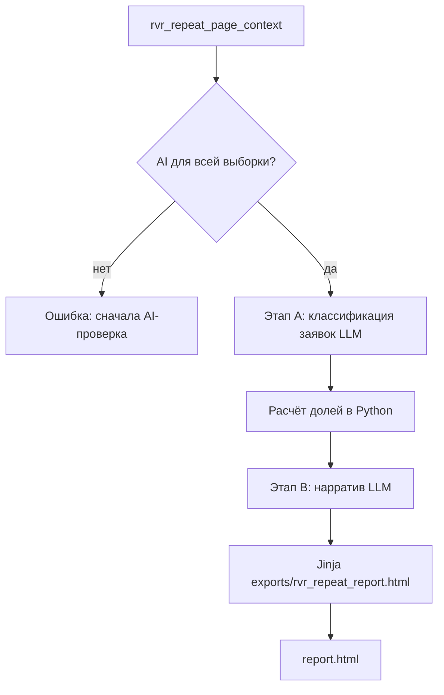

# Перспективы разработки

Запланированные, но ещё не реализованные возможности. При взятии задачи в работу — обновить статус здесь и синхронизировать `AGENTS.md`, `basic-structure.md`, `services.md`, `monitoring-db.md`.

---

## HTML-отчёт «Анализ причин неисправностей» по повторным РВР

**Статус:** запланировано (не реализовано)  
**Дата фиксации плана:** 2026-07-13  
**Контекст:** раздел «Анализ повторных РВР»; эталон — `Пример отчет/Отчет.docx` и `Пример отчет/Исходные данные.xlsx`.

### Цель

Автоматическое формирование управленческого HTML-отчёта «Анализ причин неисправностей» по выборке повторных РВР при условии, что для всей выборки выполнен AI-анализ (`rvr_ai_analysis`). Два этапа LLM через VseLLM: классификация заявок по сквозным причинам + генерация нарратива. Доли причин считаются детерминированно в Python; сборка — Jinja-шаблоном (как `render_payments_export_html`).

### Что показал разбор примера

- Эталон — `Пример отчет/Отчет.docx`. Структура: титульный блок + 5 разделов (резюме с таблицей долей → анализ по сквозным причинам с примерами заявок → разбивка по типам систем → управленческие выводы → заключение).
- Стиль: деловой, для руководителя, причинно-ориентированный (сквозные причины, не отдельные подсистемы); каждый блок заканчивается выводом. Повтор — индикатор качества устранения, не первопричина.
- `Пример отчет/Исходные данные.xlsx` = результат AI-анализа (`AiAnalysisRecord`): «Адрес / Анализ заявок / Описание проблем». Для цитирования заявок в разделах 2–3 — `report["data_rows"]` из `rvr_repeat_report.py`.

### Архитектура (планируемые модули)

| Компонент | Путь | Назначение |
|-----------|------|------------|
| Оркестратор | `backend/app/rvr_html_report.py` | Сбор данных → 2 этапа LLM → доли → контекст шаблона |
| Рендерер | `backend/app/ui/rvr_repeat_html.py` | `render_rvr_repeat_report_html(context)` |
| Шаблон | `backend/app/templates/exports/rvr_repeat_report.html` | Самодостаточный HTML + CSS, печать/PDF из браузера |
| Маршрут | `GET /rvr-repeat/report.html` в `web/routes.py` | Inline-просмотр; `?download=1` — скачивание |
| CLI | `scripts/rvr_html_report.py` | Неинтерактивная генерация (`--auto-ai`) |

Зависимости не добавляются (Jinja2 уже есть; `python-docx` не требуется).



### Алгоритм

#### 1. Сбор и валидация исходных данных

1. Получить `report` из `rvr_repeat_page_context`: `data_rows` + `groups_ge2` с AI-кэшем (`_enrich_report_groups_with_ai_cache`).
2. Предусловие: все группы с `ai_checked == True` и `ai_stale == False`.
3. Нормализовать заявки: `{id, addr, sys, date, text}`; пустой `text` → `"—"`.

#### 2. Этап A — классификация заявок (LLM)

Присвоить каждой заявке одну доминирующую причину из справочника:

| Ключ | Смысл |
|------|--------|
| `renovation` | Ремонт, реконструкция, монтаж, демонтаж, перенос |
| `network_power` | Связь, питание, сеть, ИБП/АКБ |
| `wear` | Износ механики и периферии |
| `external` | Протечки, залития, скачки напряжения |
| `repeat` | Неполное устранение / повтор по узлу |

Батчирование как в `rvr_ai_analysis.py` (~30–40 заявок, `analysis_model`, `analysis_max_concurrency`). Ответ — JSON-массив `[{id, cause, one_liner}]`.

**System-промпт этапа A:**

```text
Ты аналитик заявок на ремонт систем ТСО (САПС, СКУД, СОТС, СОУЭ, ТСВ, ОС/КТС).
Для каждой заявки определи ОДНУ доминирующую первопричину неисправности (первичный триггер).
Справочник причин (выбирай ровно один ключ):
- renovation: последствия ремонта, реконструкции, монтажа, демонтажа, переноса оборудования, вмешательства в линии/конфигурацию.
- network_power: потеря связи, каналы (LAN/GPRS), питание, ИБП/АКБ, сетевые переключения, регистраторы без связи.
- wear: естественный износ механики и периферии (замки, кнопки, считыватели, клавиатуры, вентиляторы, HDD, биотерминалы).
- external: внешние физвоздействия (протечки, залития, скачки напряжения, аварийное отключение, обрушение потолка).
- repeat: явный повтор/неполное устранение ранее возникшего дефекта по тому же узлу.
Правила: одна заявка — одна причина; при нескольких факторах бери первичный триггер; не выдумывай фактов сверх текста.
Верни строго JSON-массив без markdown:
[{"id":"<номер>","cause":"<ключ>","one_liner":"<краткая деловая формулировка сути заявки для отчёта, без номера и адреса>"}]
```

#### 3. Детерминированный расчёт (Python)

- Доли = `count(cause)/total`, округление до целых %, сумма = 100%.
- Группировки: по причинам (раздел 2), по `security_system_type` (раздел 3); до 8–10 примеров на подраздел, приоритет `ai_verdict` confirmed/suspect.
- Раздел «повторы» — из AI-матрицы по объектам с подтверждённым/подозрительным вердиктом.

#### 4. Этап B — нарратив (LLM)

Модель `settings.model` (сильная). Вход: доли, примеры, AI-выводы по объектам. Выход — JSON для шаблона (subtitle, basis, important_note, summary_intro, causes_table_comments, percent_meaning, cause_sections, system_sections, management_conclusions, final_conclusion). Примеры заявок в списки вставляет шаблон из данных этапа 3, не LLM.

**User-промпт этапа B (сокращённо):**

```text
Сформируй разделы управленческого отчёта по массиву заявок ТСО. Пиши деловым языком для руководителя, причинно-ориентированно: акцент на сквозные причины, а не на отдельные подсистемы. Повтор трактуй как индикатор качества устранения, а не как основную первопричину. Каждый блок причины и каждый блок системы заверши коротким выводом.
НЕ меняй числа: доли причин уже посчитаны и переданы ниже — используй их как есть, поясняй словами.
Верни строго JSON по схеме {subtitle, basis, important_note, summary_intro, causes_table_comments, percent_meaning[], cause_sections{intro,conclusion}, system_sections{intro,conclusion}, management_conclusions[], final_conclusion}.
ДАННЫЕ: {period, percentages, causes, systems, ai_object_notes}
```

#### 5. Сборка HTML

Jinja-шаблон: `<h1>`–`<h3>`, таблица долей, `<ul>`/`<ol>`, блоки «Вывод:»/«Итог:», встроенный CSS + `@media print`. Имя файла: `rvr_repeat_report_<from>_<to>_<stamp>.html`.

#### 6. Ошибки и недостающие данные

- Нет данных / неполный AI → блокировка с понятным сообщением.
- Сбой LLM: ретраи батча; этап A — `unknown` исключается; этап B — фолбэк на шаблонные абзацы из долей.
- Числа только из Python; номера заявок и адреса — только из `data_rows`; Jinja autoescape.

#### 7. Кэширование

- Этап A: по отпечатку заявки (`id`+`text`) — новая таблица в SQLite (по образцу `rvr_ai_analysis`).
- Этап B: по отпечатку агрегатов (доли + примеры + период).

#### 8. Автоматизация

- Веб: кнопка на странице РВР (активна при полном свежем AI); опционально вложение в `rvr_repeat_report_email`.
- CLI: `scripts/rvr_html_report.py` с `--auto-ai`.

### Рекомендации по качеству

- Дешёвая модель на этап A, сильная — на этап B.
- Все числа в коде; LLM — только текст.
- Few-shot из `Пример отчет/Отчет.docx` в промпт этапа B.
- Строгий JSON + ретрай при невалидном ответе (`_extract_json_array`).
- Регресс на `Исходные данные.xlsx` как эталон структуры.

### Чеклист реализации

- [ ] `templates/exports/rvr_repeat_report.html`
- [ ] `ui/rvr_repeat_html.py`
- [ ] `rvr_html_report.py` (оркестратор + промпты)
- [ ] Кэш классификации/нарратива в `state_store.py`
- [ ] Маршрут `GET /rvr-repeat/report.html` + кнопка в partial
- [ ] Обработка ошибок и фолбэки
- [ ] `scripts/rvr_html_report.py`
- [ ] Документация: `AGENTS.md`, `basic-structure.md`, `services.md`, `monitoring-db.md`

### Связанный код (уже есть)

- `backend/app/rvr_repeat_report.py` — выборка и группировка
- `backend/app/rvr_ai_analysis.py` — пообъектный AI-анализ
- `backend/app/ui/rvr_repeat_export.py` — XLSX-экспорт
- `backend/app/ui/payments_export.py` — образец HTML-экспорта
- `backend/app/llm/client.py` — VseLLM
