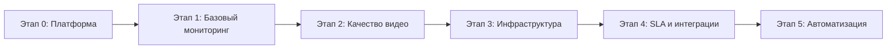

# Мониторинг исправности видеонаблюдения Wisenet — бизнес-требования и этапы

> **Статус:** черновик на согласование  
> **Версия:** 0.3  
> **Дата:** 2026-05-20

Документ описывает цели, общие бизнес-требования и поэтапный план развития системы.  
**Интерфейс:** [UI_REQUIREMENTS.md](./UI_REQUIREMENTS.md) — тёмная тема, иерархия Объект → Регистратор.  
Техническая спецификация API — в отдельных документах по мере появления этапов.

---

## 1. Контекст и цель

### 1.1. Проблема

В эксплуатации находится крупная система видеонаблюдения на базе Wisenet (порядка **4000+ камер**). Неисправности (сеть, запись, качество изображения) часто обнаруживаются поздно — при расследовании инцидента или по жалобе, а не проактивно.

### 1.2. Цель продукта

Построить **единую платформу** для проактивного контроля исправности видеонаблюдения:

- централизованный учёт с иерархией **объект → регистратор (NVR/DVR)** и (на следующих этапах) каналов/камер;
- автоматические проверки состояния;
- наглядное отображение для операторов и отчётность для руководства/служб безопасности.

### 1.3. Принцип развития

**Сначала платформа, затем функционал мониторинга.**  
На первом этапе — веб-интерфейс, бэкенд, хранение конфигурации и проверка связи с регистраторами. Проверки качества видео, инфраструктуры, SLA и автоматизация — последующими этапами без пересборки основы.

---

## 2. Заинтересованные стороны (предварительно)

| Роль | Интерес |
|------|---------|
| Эксплуатация / ТСО | Быстро видеть, что «лежит», меньше ручного обхода |
| Служба безопасности | Исправность в критичных зонах, особенно в момент тревоги |
| Руководство / отчётность | % исправности по объектам, регионам, тренды |
| Инженеры / подрядчик | Понятные инциденты, группировка по объекту, не 4000 отдельных тикетов |
| Разработка / владелец продукта | Расширяемая платформа, единый конфиг, API Wisenet (SUNAPI) |

*Уточнение организационных ролей и SLA — в блоке «Открытые вопросы».*

---

## 3. Общие бизнес-требования

### 3.1. Иерархия и учёт объектов

Базовая модель данных:

```text
Объект (object_name)  →  1..N Регистраторов (NVR/DVR)  →  (этап 1+) Каналы/камеры
```

- **Объект** — логическая точка эксплуатации (отделение, ВСП, офис и т.п.), задаётся **названием**.
- **Регистратор** всегда привязан к одному объекту; отдельный справочник объектов на этапе 0 **не ведётся** — объект появляется вместе с первым регистратором с таким `object_name`.
- На одном объекте может быть несколько регистраторов.

Целевая иерархия для отчётности (этапы 1+): `Регион → Город → Объект → Регистратор → Канал`.

| ID | Требование | Приоритет |
|----|------------|-----------|
| BR-01 | Пользователь добавляет, изменяет и удаляет **регистраторы** (NVR/DVR) через веб-интерфейс | Must |
| BR-02 | Список регистраторов, привязка к объектам и общие параметры подключения **сохраняются в JSON-конфиге** | Must |
| BR-03 | Для всех устройств используется **одна учётная запись** (логин/пароль), задаётся в конфиге | Must |
| BR-04 | При создании/редактировании регистратора пользователь обязательно указывает **название объекта** (`object_name`) | Must |
| BR-05 | Для каждого регистратора хранятся: `id`, `object_name`, имя регистратора (опционально), `host`, `port`, `use_https`, `enabled` | Must |
| BR-06 | В UI регистраторы отображаются **сгруппированными по объекту**; доступен также плоский список (см. UI_REQUIREMENTS) | Must |
| BR-07 | Агрегированный статус объекта выводится по «худшему» статусу дочерних регистраторов (для этапа 0 — по результату последней проверки связи) | Should |
| BR-08 | На этапе платформы отдельный CRUD «только объект» не требуется; массовый учёт **каналов/камер** — этап 1 | Must |

### 3.2. Проверка доступности (этап платформы)

| ID | Требование | Приоритет |
|----|------------|-----------|
| BR-10 | Пользователь может **вручную запустить проверку** связи с выбранным регистратором | Must |
| BR-11 | Система отображает результат: доступен / недоступен, время проверки, краткое описание ошибки | Must |
| BR-12 | Проверка подтверждает не только сеть, а **ответ прикладного API** устройства (SUNAPI), а не только ICMP | Should (этап 0 — минимум: успешный HTTP-запрос к API) |

### 3.3. Интерфейс и доступ

| ID | Требование | Приоритет |
|----|------------|-----------|
| BR-20 | Веб-интерфейс на **серверных шаблонах (Jinja2) с HTMX**; CRUD и проверки — HTML-формы и частичные обновления, **без SPA и Node.js** | Must |
| BR-21 | Бэкенд на **Python** | Must |
| BR-22 | На этапе платформы **авторизация в UI не требуется** (допущение: доступ только из доверенной внутренней сети) | Must |
| BR-23 | Интерфейс на русском языке | Should |
| BR-24 | Визуальные и UX-требования — **современная тёмная тема**; детали в [UI_REQUIREMENTS.md](./UI_REQUIREMENTS.md) | Must |

### 3.4. Конфигурация и эксплуатация

| ID | Требование | Приоритет |
|----|------------|-----------|
| BR-30 | Формат конфигурации — **JSON** (читаемый, версионируемый вместе с проектом или на сервере) | Must |
| BR-31 | Изменения из UI **записываются в тот же конфиг**, который использует бэкенд при старте и после сохранения | Must |
| BR-32 | Должен быть **пример конфига** без реальных паролей для развёртывания | Must |
| BR-33 | Пароли не должны попадать в публичные репозитории (рекомендация: отдельный локальный файл или переменные окружения — уточнить на этапе внедрения) | Should |

### 3.5. Масштаб и надёжность (сквозные, нарастающие)

| ID | Требование | Приоритет |
|----|------------|-----------|
| BR-40 | Архитектура должна допускать рост до **тысяч камер** без смены модели «регистратор → каналы» | Should |
| BR-41 | При массовых отказах на одном объекте алерты **группируются по объекту**, а не по одной камере или NVR | Should (этапы мониторинга) |
| BR-42 | Критичные зоны (касса, хранилище, вход и т.д.) — **повышенный приоритет** проверок и оповещений | Could (после инвентаризации зон) |

### 3.6. Определение «исправности» (целевая модель, не этап 0)

Для последующих этапов фиксируется целевая логика состояний:

| Состояние | Бизнес-смысл |
|-----------|----------------|
| **Исправна** | Доступна, отдаёт поток/снапшот, пишет архив в пределах нормы, изображение пригодно для использования |
| **Деградация** | Работает, но есть риск (диск заполнен, расхождение времени, плохое качество кадра) |
| **Неисправна** | Нет связи, нет записи, чёрный кадр, потеря видео и т.п. |
| **Неизвестно** | Нет данных опроса (сеть, лимит API, устройство выключено в конфиге) |

Детальные пороги (глубина архива, NTP, качество кадра) — на этапах мониторинга.

---

## 4. Допущения и ограничения

### 4.1. Допущения

- Оборудование — Wisenet / Hanwha, доступ к устройствам по **SUNAPI** (HTTP/HTTPS).
- Учётная запись для опроса **единая** для всех регистраторов и (позже) камер.
- Пилот и первая версия — **без аутентификации** в веб-UI; защита — сетевая изоляция.

### 4.2. Ограничения

- ML/GPU-аналитика **не входит** в ранние этапы без отдельного обоснования бюджета.
- Автоматический перезагруз устройств и создание тикетов — только после согласования политик безопасности.

---

## 5. Этапы реализации

### Этап 0. Платформа (текущий фокус)

**Цель:** возможность вести реестр регистраторов и проверять связь через единый веб-интерфейс.

| Возможность | В scope | Вне scope |
|-------------|---------|-----------|
| CRUD регистраторов с привязкой к **объекту** (`object_name`) | ✓ | |
| Группировка в UI: объект → регистраторы | ✓ | |
| JSON-конфиг (credentials + recorders) | ✓ | |
| Python-бэкенд (FastAPI) | ✓ | |
| Веб-UI (Jinja2 + HTMX, тёмная тема, см. UI_REQUIREMENTS) | ✓ | |
| Отдельный JSON REST API для UI | | ✓ (не требуется на этапе 0) |
| Ручная проверка связи (SUNAPI) | ✓ | |
| Отдельный справочник объектов (без NVR) | | ✓ |
| Авторизация пользователей | | ✓ |
| Список каналов/камер с NVR | | ✓ |
| Фоновый опрос по расписанию | | ✓ |
| Алерты, дашборды, отчёты | | ✓ |

**Критерии приёмки этапа 0:**

1. Добавленный регистратор с `object_name` появляется в JSON и в **группе соответствующего объекта** в UI.
2. Два регистратора с одним `object_name` отображаются в одной группе.
3. Удаление/редактирование отражается в конфиге; при удалении последнего NVR группа объекта исчезает.
4. «Проверить» возвращает понятный статус успех/ошибка для доступного и недоступного NVR.
5. Пример `config.example.json` документирован (включая поле `object_name`).

**Пример фрагмента конфига:**

```json
{
  "credentials": { "username": "admin", "password": "***" },
  "recorders": [
    {
      "id": "nvr-001",
      "object_name": "Отделение №12 — Москва",
      "name": "NVR-1",
      "host": "10.1.2.3",
      "port": 80,
      "use_https": false,
      "enabled": true
    }
  ]
}
```

---

### Этап 1. Базовый мониторинг исправности

**Цель:** проактивно видеть отказы доступности и записи на масштабе парка.

| Возможность | Описание |
|-------------|----------|
| Инвентаризация | Автоматическое получение списка каналов/камер с каждого регистратора |
| Периодический опрос | Расписание проверок (сеть, SUNAPI, статус каналов) |
| NVR-метрики | Статус HDD, заполненность, температура (где доступно API), глубина архива vs норматив |
| Время | Контроль расхождения NTP |
| UI «светофор» | Иерархия: объект → регистратор → канал; зелёный/жёлтый/красный |
| История | Хранение состояний и времени простоя для отчётов |

**Критерии приёмки (ориентир):** известный статус ≥ 95% включённых каналов; задержка обнаружения отказа — в пределах согласованного интервала опроса (например, 5–15 мин).

---

### Этап 2. Качество видео и события устройства

**Цель:** ловить «тихие» отказы: чёрный кадр, расфокус, перекрытие, смещение.

| Возможность | Описание |
|-------------|----------|
| События Wisenet | Подписка на videoloss, tampering, defocus и др. (HTTP callback / опрос) |
| Снапшоты | Периодический снимок кадра и базовые проверки (яркость, резкость) |
| Эталонные кадры | Сравнение с baseline для смещения/перекрытия (пилот на типовых объектах) |

---

### Этап 3. Инфраструктура и соответствие

**Цель:** отличать «сломалась камера» от «пропало питание/сеть».

| Возможность | Описание |
|-------------|----------|
| SNMP / PoE | Статус портов, потребление, корреляция массовых отвалов |
| Прошивки | Инвентаризация версий, алерты на устаревшие |
| Compliance | Отчёты по непрерывности записи, «слепые зоны» по времени |

---

### Этап 4. Аналитика, SLA и интеграции

**Цель:** отчётность для руководства и связка с процессами банка.

| Возможность | Описание |
|-------------|----------|
| SLA-отчёты | % исправности по регионам/объектам, топ проблемных точек |
| Корреляция с ОПС | Проверка записи в момент тревоги |
| Экспорт | Интеграция с Grafana/Zabbix/корпоративным мониторингом (по решению) |
| Прогнозирование | SMART дисков, тренды отказов (при накоплении истории) |

---

### Этап 5. Автоматизация (опционально)

**Цель:** сократить MTTR без риска для безопасности.

| Возможность | Описание |
|-------------|----------|
| Авто-ребут | По политике, с журналированием |
| Тикеты | ServiceNow / Jira / внутренняя система |
| Уведомления | Telegram/Mattermost/e-mail для дежурных |
| Self-healing | Только после аудита и ограничений на критичные зоны |

---

## 6. Сводная дорожная карта



| Этап | Срок (заполнить) | Зависимости |
|------|------------------|-------------|
| 0 | *TBD* | — |
| 1 | *TBD* | Этап 0 |
| 2 | *TBD* | Этап 1, пилотные объекты |
| 3 | *TBD* | Доступ SNMP/UPS (если есть) |
| 4 | *TBD* | История с этапа 1, входные SLA |
| 5 | *TBD* | Политики СБ, интеграции |

---

## 7. Нефункциональные требования (кратко)

| Область | Требование |
|---------|------------|
| Развёртывание | Возможность запуска на одном сервере (пилот); далее — горизонтальное масштабирование опроса |
| Логирование | Действия пользователя в UI, результаты опросов, ошибки API |
| Производительность | Ограничение параллельных запросов к устройствам (защита от перегрузки SUNAPI) |
| Резервирование | Резервное копирование JSON-конфига; позже — БД состояний |

---

## 8. Открытые вопросы (для следующих согласований)

1. **VMS:** Wisenet WAVE / SSM / иное — влияет на источник инвентаря и архитектуры опроса.
2. **Сеть:** прямой L3-доступ к NVR из ЦОД или только через NAT/VMS.
3. **Норматив архива:** требуемая глубина (например, 30 суток) и пороги алертов.
4. **Топ-3 боли** сейчас: что чаще всего пропускается (сеть, чёрный кадр, диск, время).
5. **Команда поддержки:** штат / подрядчик — формат инцидентов на этапе 5.
6. **Пилот:** 1–2 объекта для этапов 1–2.
7. **Хранение пароля:** только JSON vs env/секрет-хранилище для прода.

---

## 9. История изменений документа

| Версия | Дата | Изменения |
|--------|------|-----------|
| 0.1 | 2026-05-20 | Первый черновик: платформа (React, JSON, Python), этапы 0–5 |
| 0.2 | 2026-05-20 | Иерархия Объект → Регистратор; ссылка на UI_REQUIREMENTS.md |
| 0.3 | 2026-05-20 | Отказ от React/Vite: веб-UI на Jinja2 + HTMX, один процесс uvicorn |

---

## 10. Согласование

| Роль | ФИО | Дата | Статус |
|------|-----|------|--------|
| Заказчик / владелец | | | |
| Разработка | | | |

*После вашей проверки: правки вносятся в документы, версия повышается.*
