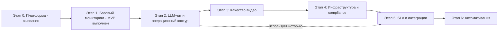

# Дашборд руководителя ТСО — бизнес-требования и этапы

> **Статус:** актуализировано по фактическому состоянию проекта  
> **Версия:** 0.5  
> **Дата:** 2026-06-09

Документ описывает цели, общие бизнес-требования, фактически реализованное состояние и поэтапный план развития системы.  
**Интерфейс:** [UI_REQUIREMENTS.md](./UI_REQUIREMENTS.md) — тёмная тема, иерархия Объект → вид системы → устройство.  
Технические детали текущей реализации: [ai-docs/services.md](../ai-docs/services.md), [ai-docs/monitoring-db.md](../ai-docs/monitoring-db.md).

Продукт эволюционировал из мониторинга Wisenet NVR в **сводный дашборд руководителя ТСО**: технический мониторинг (ТСВ, СКУД, Биотерминалы, СОТС) отделён от разделов Бюджет, Арсенал и Smartview (собственные данные и алгоритмы).

---

## 1. Контекст и цель

### 1.1. Проблема

В эксплуатации находится крупная система видеонаблюдения на базе Wisenet (порядка **4000+ камер**). Неисправности (сеть, запись, качество изображения) часто обнаруживаются поздно — при расследовании инцидента или по жалобе, а не проактивно.

### 1.2. Цель продукта

Построить **единую платформу** для проактивного контроля исправности видеонаблюдения:

- централизованный учёт с иерархией **объект → регистратор (NVR/DVR) → канал/камера**;
- автоматические проверки состояния;
- наглядное отображение для операторов и отчётность для руководства/служб безопасности.

### 1.3. Принцип развития

**Сначала платформа, затем функционал мониторинга.**  
Платформенный слой и базовый мониторинг уже реализованы: веб-интерфейс, бэкенд, JSON-конфиг, SQLite-хранилище результатов, периодический SUNAPI-опрос, история и дашборды. Следующие этапы развивают качество диагностики, LLM-чат для работы с накопленными данными, инфраструктурную корреляцию, SLA и автоматизацию без пересборки основы.

---

## 2. Заинтересованные стороны (предварительно)

| Роль | Интерес |
|------|---------|
| Эксплуатация / ТСО | Быстро видеть, что «лежит», меньше ручного обхода |
| Служба безопасности | Исправность в критичных зонах, особенно в момент тревоги |
| Руководство / отчётность | % исправности по объектам, регионам, тренды |
| Инженеры / подрядчик | Понятные инциденты, группировка по объекту, не 4000 отдельных тикетов |
| Разработка / владелец продукта | Расширяемая платформа, единый конфиг, API Wisenet (SUNAPI) |

*Уточнение организационных ролей и SLA — в блоке «Открытые вопросы».*

---

## 3. Общие бизнес-требования

### 3.1. Иерархия и учёт объектов

Базовая модель данных:

```text
Объект (object_name)  →  1..N Регистраторов (NVR/DVR)  →  Каналы/камеры
```

- **Объект** — логическая точка эксплуатации (отделение, ВСП, офис и т.п.), задаётся **названием**.
- **Регистратор** всегда привязан к одному объекту; отдельный справочник объектов на этапе 0 **не ведётся** — объект появляется вместе с первым регистратором с таким `object_name`.
- На одном объекте может быть несколько регистраторов.
- Каналы/камеры автоматически инвентаризируются с NVR и хранятся в SQLite (`monitoring.db`) вместе с текущими статусами и историей.

Целевая иерархия для отчётности (будущие этапы): `Регион → Город → Объект → Регистратор → Канал`. Сейчас `region` и `city` в модели не выделены.

| ID | Требование | Приоритет |
|----|------------|-----------|
| BR-01 | Пользователь добавляет, изменяет и удаляет **регистраторы** (NVR/DVR) через веб-интерфейс | Must |
| BR-02 | Список регистраторов, привязка к объектам и общие параметры подключения **сохраняются в JSON-конфиге** | Must |
| BR-03 | Для всех устройств используется **одна учётная запись** (логин/пароль), задаётся в конфиге | Must |
| BR-04 | При создании/редактировании регистратора пользователь обязательно указывает **название объекта** (`object_name`) | Must |
| BR-05 | Для каждого регистратора хранятся: `id`, `object_name`, имя регистратора (опционально), `host`, `port`, `use_https`, `enabled` | Must |
| BR-06 | В UI регистраторы отображаются **сгруппированными по объекту**; доступен также плоский список (см. UI_REQUIREMENTS) | Must |
| BR-07 | Агрегированный статус объекта выводится по «худшему» статусу дочерних регистраторов (для этапа 0 — по результату последней проверки связи) | Should |
| BR-08 | Отдельный CRUD «только объект» не требуется; объект появляется через `object_name` регистратора | Must |
| BR-09 | Система хранит текущие состояния каналов, метрики регистраторов и историю смены статусов в SQLite | Must |

### 3.2. Проверка доступности (этап платформы)

| ID | Требование | Приоритет |
|----|------------|-----------|
| BR-10 | Пользователь может **вручную запустить проверку** связи с выбранным регистратором | Must |
| BR-11 | Система отображает результат: доступен / недоступен, время проверки, краткое описание ошибки | Must |
| BR-12 | Проверка подтверждает не только сеть, а **ответ прикладного API** устройства (SUNAPI), а не только ICMP | Should (этап 0 — минимум: успешный HTTP-запрос к API) |

### 3.3. Интерфейс и доступ

| ID | Требование | Приоритет |
|----|------------|-----------|
| BR-20 | Веб-интерфейс на **серверных шаблонах (Jinja2) с HTMX**; CRUD и проверки — HTML-формы и частичные обновления, **без SPA и Node.js** | Must |
| BR-21 | Бэкенд на **Python** | Must |
| BR-22 | На этапе платформы **авторизация в UI не требуется** (допущение: доступ только из доверенной внутренней сети) | Must |
| BR-23 | Интерфейс на русском языке | Should |
| BR-24 | Визуальные и UX-требования — **современная тёмная тема**; детали в [UI_REQUIREMENTS.md](./UI_REQUIREMENTS.md) | Must |

### 3.4. Конфигурация и эксплуатация

| ID | Требование | Приоритет |
|----|------------|-----------|
| BR-30 | Формат конфигурации устройств и порогов — **JSON** (читаемый, версионируемый вместе с проектом или на сервере) | Must |
| BR-31 | Изменения из UI **записываются в тот же конфиг**, который использует бэкенд при старте и после сохранения | Must |
| BR-32 | Должен быть **пример конфига** без реальных паролей для развёртывания | Must |
| BR-33 | Пароли не должны попадать в публичные репозитории (рекомендация: отдельный локальный файл или переменные окружения — уточнить на этапе внедрения) | Should |
| BR-34 | Результаты мониторинга, история и аналитические данные хранятся отдельно от конфигурации, в SQLite `monitoring.db` | Must |

### 3.5. Масштаб и надёжность (сквозные, нарастающие)

| ID | Требование | Приоритет |
|----|------------|-----------|
| BR-40 | Архитектура должна допускать рост до **тысяч камер** без смены модели «регистратор → каналы» | Should |
| BR-41 | При массовых отказах на одном объекте алерты **группируются по объекту**, а не по одной камере или NVR | Should (этапы мониторинга) |
| BR-42 | Критичные зоны (касса, хранилище, вход и т.д.) — **повышенный приоритет** проверок и оповещений | Could (после инвентаризации зон) |

### 3.6. Определение «исправности» (целевая модель, не этап 0)

Для последующих этапов фиксируется целевая логика состояний:

| Состояние | Бизнес-смысл |
|-----------|----------------|
| **Исправна** | Доступна, отдаёт поток/снапшот, пишет архив в пределах нормы, изображение пригодно для использования |
| **Деградация** | Работает, но есть риск (диск заполнен, расхождение времени, плохое качество кадра) |
| **Неисправна** | Нет связи, нет записи, чёрный кадр, потеря видео и т.п. |
| **Неизвестно** | Нет данных опроса (сеть, лимит API, устройство выключено в конфиге) |

Пороги глубины архива, NTP, температуры HDD и доли проблемных каналов уже параметризованы в `config.json`. Пороги качества кадра и инфраструктурной корреляции — будущие этапы.

### 3.7. LLM-чат и аналитический помощник (новый целевой блок)

| ID | Требование | Приоритет |
|----|------------|-----------|
| BR-50 | Пользователь может задавать вопросы на русском языке о состоянии объектов, NVR, каналов, архива, времени/NTP, дисков и истории | Must |
| BR-51 | Чат использует фактические данные из `monitoring.db` и `config.json`, включая привязку `object_name` → `recorder_id` | Must |
| BR-52 | Доступ к данным для LLM выполняется через контролируемый read-only слой: заранее описанные представления/запросы или безопасный query service, без произвольных SQL-команд от модели | Must |
| BR-53 | Ответы должны указывать актуальность данных: `last_polled_at`, статус онлайн/оффлайн и предупреждение о возможной устарелости метрик | Must |
| BR-54 | Чат должен уметь возвращать ссылки/переходы в релевантные UI-разделы: объект, регистратор, каналы, история, статус | Should |
| BR-55 | Диалоговая история, вопросы и ответы сохраняются в БД с привязкой ко времени и пользователю/сессии, когда появится аутентификация | Should |
| BR-56 | На первом релизе LLM не выполняет управляющие действия: не меняет конфиг, не запускает NTP/опрос/ребут без явного отдельного механизма подтверждения | Must |

---

## 4. Допущения и ограничения

### 4.1. Допущения

- Оборудование — Wisenet / Hanwha, доступ к устройствам по **SUNAPI** (HTTP/HTTPS).
- Учётная запись для опроса **единая** для всех регистраторов; данные каналов/камер получаются через NVR.
- Пилот и первая версия — **без аутентификации** в веб-UI; защита — сетевая изоляция.

### 4.2. Ограничения

- ML/GPU-аналитика **не входит** в ранние этапы без отдельного обоснования бюджета.
- Автоматическая перезагрузка устройств и создание тикетов — только после согласования политик безопасности.

---

## 5. Фактическое состояние реализации

### 5.1. Этап 0. Платформа — выполнен

**Цель:** вести реестр регистраторов и проверять связь через единый веб-интерфейс.

| Возможность | Статус |
|-------------|--------|
| CRUD регистраторов с привязкой к `object_name` | Выполнено |
| Группировка в UI: объект → регистраторы | Выполнено |
| JSON-конфиг: credentials, monitoring, recorders | Выполнено |
| Python-бэкенд FastAPI | Выполнено |
| Веб-UI Jinja2 + HTMX, тёмная тема | Выполнено |
| Ручная проверка связи по SUNAPI | Выполнено |
| Настройки credentials и порогов мониторинга из UI | Выполнено |
| Пример `config.example.json` без реальных паролей | Выполнено |

**Ограничения этапа 0, которые сохраняются:** отдельного справочника объектов нет; аутентификация пользователей не реализована; учётная запись API единая для всех устройств.

### 5.2. Этап 1. Базовый мониторинг исправности — выполнен как MVP

**Цель:** проактивно видеть отказы доступности, записи и базовых параметров NVR/каналов.

| Возможность | Фактическое состояние |
|-------------|-----------------------|
| Инвентаризация каналов | Реализовано через SUNAPI, данные каналов сохраняются в SQLite |
| Периодический опрос | Реализован `MonitoringScheduler` с коротким и полным циклом |
| Ручный массовый опрос | Реализованы действия «опросить все», «инвентаризация всех», прогресс фоновой задачи |
| NVR-метрики | Реализованы модель/прошивка, online, диски, температура, архив, системные события |
| Время / NTP | Реализованы контроль расхождения, статус синхронизации и массовое включение NTP |
| UI «светофор» | Реализованы дашборды по объектам, регистраторам и категориям здоровья |
| История | Реализованы `status_history` и `category_status_history` |
| Отчётность | Реализован HTML-экспорт текущих проблем; SLA-отчётность ещё не реализована |
| CMDB-загрузка | Есть скрипт синхронизации `config.json` из `cmdb.xlsx` |

**Остаточные доработки этапа 1, которые нужно не забыть в дальнейших работах:**

1. Уточнить эксплуатационные регламенты: интервалы опроса, норматив архива, пороги по времени и температуре для пилотных объектов.
2. Описать retention-политику для SQLite-истории и резервное копирование `config.json` + `monitoring.db`.
3. Подготовить рабочую инструкцию для оператора: что означает каждый статус и какие действия выполнять.
4. Синхронизировать README и пользовательские инструкции с фактическим состоянием «этап 1+», а не только «этап 0».

### 5.3. Заделы будущих этапов, уже присутствующие в проекте

| Направление | Уже есть | Чего ещё не хватает |
|-------------|----------|---------------------|
| Качество видео | VideoLoss, connected/register status из SUNAPI-событий | Снапшоты, яркость/резкость, tampering/defocus как отдельные правила, baseline кадров |
| Инфраструктура | HDD, температура, системные события, прошивки/модели в метриках | SNMP/PoE/UPS, топология сети, корреляция массовых отказов |
| Аналитика | История статусов и категорий, экспорт текущих ошибок | SLA-периоды, управленческие отчёты, тренды по регионам/городам |
| LLM-интеграция | Документирована схема `monitoring.db`, есть типовые SQL-примеры | UI чата, read-only query layer, провайдер LLM, аудит диалогов |

---

## 6. Дальнейшие этапы реализации

### Этап 2. Операционный контур и LLM-чат

**Цель:** дать оператору и инженеру диалоговый интерфейс к фактическим данным мониторинга: «что сейчас сломано», «где нет архива», «какие камеры проблемные на объекте», «когда началась проблема».

**Почему этап ставится раньше видеоаналитики:** в проекте уже есть SQLite с метриками, каналами и историей, поэтому LLM-чат можно строить поверх текущих данных без ожидания SNMP или анализа кадров.

| Блок работ | Задачи |
|------------|--------|
| Read-only слой данных | Создать сервис безопасных запросов к `monitoring.db` и `config.json`; объединять `object_name`, параметры NVR и метрики по `recorder_id`; запретить произвольные SQL-команды от LLM |
| Представления для аналитики | Подготовить предопределённые выборки: проблемные объекты, проблемные NVR, каналы с ошибками, архив ниже нормы, NTP/время, HDD/температура, активные системные события, история смен статуса |
| LLM orchestration | Добавить абстракцию провайдера LLM, системный промпт на русском языке, вызов только разрешённых инструментов, обработку ошибок и таймаутов |
| UI чата | Добавить страницу/панель «Помощник»; поддержать потоковый или пошаговый ответ, индикатор источников данных, ссылки на объект/NVR/каналы/историю |
| История диалогов | Создать таблицы для сессий, сообщений, использованных источников/запросов; предусмотреть очистку истории |
| Безопасность | Хранить ключ LLM вне репозитория; добавить лимиты частоты, журналирование, маскирование секретов; на первом релизе запретить управляющие действия из чата |
| Тестирование | Покрыть query layer, типовые вопросы, отсутствие write-SQL, ответы при пустой/устаревшей БД и offline-NVR |

**Минимальные сценарии приёмки:**

1. На вопрос «Какие объекты сейчас с проблемами?» чат возвращает список объектов с количеством проблемных NVR/каналов и временем последнего опроса.
2. На вопрос «Что с архивом на объекте X?» чат показывает NVR/каналы с `archive_min_days` / `archive_days`, норматив и статус.
3. На вопрос «Когда началась проблема с NVR Y?» чат использует `status_history` / `category_status_history` и показывает последнюю смену статуса.
4. Ответы содержат предупреждение, если данные устарели или NVR недоступен.
5. Модель не может изменить конфиг, запустить опрос, включить NTP или выполнить произвольный SQL.

**Не входит в этап 2:** автоматическое исправление проблем через чат, голосовой интерфейс, обучение собственной модели, анализ изображений LLM/VLM.

### Этап 3. Качество видео и расширенные события устройства

**Цель:** ловить «тихие» отказы, которые не всегда видны по доступности устройства: чёрный кадр, сильный пересвет/темнота, расфокус, перекрытие, смещение камеры.

| Блок работ | Задачи |
|------------|--------|
| События Wisenet | Расширить обработку `eventstatus`: tampering, defocus, motion/video analytics events, если поддерживается моделью |
| Снапшоты | Получать периодические кадры по каналам с ограничением частоты и параллелизма; хранить только необходимые диагностические признаки и короткий retention кадров |
| Базовые проверки изображения | Рассчитывать яркость, контраст, резкость, долю почти чёрных/белых пикселей; завести пороги warn/error |
| Baseline | Для пилотных объектов сохранить эталонные признаки/кадры и сравнивать смещение/перекрытие |
| UI | Добавить категории «Качество изображения» и страницу детализации по кадру/каналу |
| Тестирование | Unit-тесты алгоритмов на синтетических изображениях; пилот на 1-2 объектах |

**Критерии приёмки:** система выявляет чёрный/засвеченный кадр и потерю видео на пилотных каналах; ложные срабатывания фиксируются и калибруются порогами.

### Этап 4. Инфраструктура, топология и соответствие

**Цель:** отличать отказ камеры/NVR от отказа сети, питания или PoE-инфраструктуры и формировать доказательные compliance-отчёты.

| Блок работ | Задачи |
|------------|--------|
| Топология | Ввести или импортировать связи объект → коммутатор → порт → NVR/камера, где данные доступны |
| SNMP / PoE / UPS | Опросить статус портов, PoE-питание, загрузку, питание/UPS; сопоставлять массовые отказы с сетевыми событиями |
| География | Добавить модель `region` / `city` / `object` или устойчивый импорт этих полей из CMDB |
| Compliance | Отчёты по непрерывности записи, «слепым зонам» по времени, выполнению норматива архива |
| Корреляция | Группировать инциденты: одиночная камера, NVR, весь объект, сеть/питание |

**Критерии приёмки:** при массовом отвале каналов система показывает вероятную общую причину; отчёт по объекту показывает периоды без записи и несоответствие нормативу.

### Этап 5. SLA, управленческая аналитика и интеграции

**Цель:** перейти от оперативного мониторинга к отчётности для руководства и процессов эксплуатации.

| Блок работ | Задачи |
|------------|--------|
| SLA-метрики | Рассчитывать % исправности по регионам, городам, объектам, NVR и категориям проблем |
| Периоды отчётности | День/неделя/месяц, сравнение периодов, топ проблемных объектов |
| Интеграции мониторинга | Экспорт в Grafana/Zabbix/Prometheus или корпоративную систему по выбранному формату |
| Корреляция с ОПС | Проверять наличие записи и исправность камер в момент тревоги |
| Прогнозирование | Использовать накопленную историю для трендов отказов, дисков, архива и повторяющихся проблем |

**Критерии приёмки:** формируется управленческий отчёт за период; данные можно передать во внешнюю систему мониторинга без ручной выгрузки из UI.

### Этап 6. Автоматизация и управляемое восстановление

**Цель:** сократить MTTR без нарушения требований безопасности.

| Блок работ | Задачи |
|------------|--------|
| Уведомления | Настроить e-mail/Telegram/Mattermost или корпоративный канал для дежурных |
| Тикеты | Создание и обновление инцидентов в ServiceNow/Jira/внутренней системе |
| Runbooks | Для типовых проблем показывать оператору рекомендуемые действия, включая подсказки LLM-чата |
| Управляющие действия | Перезагрузка устройства, повторная синхронизация времени, запуск внепланового опроса — только через явное подтверждение и журналирование |
| Self-healing | Разрешать только после аудита, политики СБ и ограничений на критичные зоны |

**Критерии приёмки:** уведомления и тикеты создаются с корректной группировкой по объекту; любые действия, влияющие на устройства, имеют аудит и ручное подтверждение.

---

## 7. Сводная дорожная карта



| Этап | Статус | Зависимости |
|------|--------|-------------|
| 0 | Выполнен | — |
| 1 | Выполнен как MVP; требуется эксплуатационная доводка | Этап 0 |
| 2 | Следующий приоритет | Этап 1, `monitoring.db`, политика выбора LLM-провайдера |
| 3 | План | Этап 1, пилотные объекты, доступ к снапшотам |
| 4 | План | CMDB/топология, SNMP/UPS/PoE-доступы |
| 5 | План | История за период, SLA-правила, выбранные интеграции |
| 6 | Опционально после согласований | Политики СБ, тикет-система, подтверждённые runbooks |

---

## 8. Нефункциональные требования

| Область | Требование |
|---------|------------|
| Развёртывание | Возможность запуска на одном сервере для пилота; далее — масштабирование опроса и БД по результатам нагрузки |
| Логирование | Действия пользователя в UI, результаты опросов, ошибки API, действия LLM-чата и использованные источники данных |
| Производительность | Ограничение параллельных запросов к устройствам и LLM; защита SUNAPI от перегрузки |
| Резервирование | Резервное копирование `config.json` и `monitoring.db`; отдельная политика retention для истории и диалогов |
| Безопасность | Секреты вне репозитория; LLM-ключи и credentials не выводятся в UI и не передаются в промпт без необходимости |
| Аудит | Все будущие управляющие действия должны иметь явное подтверждение, автора, время и результат |
| Надёжность LLM | Ответы LLM должны быть проверяемыми по источникам данных; при недостатке данных чат обязан отвечать «нет данных», а не предполагать |

---

## 9. Открытые вопросы

1. **LLM-провайдер:** локальная модель, корпоративный API или внешний сервис; требования к изоляции данных и журналированию.
2. **Доступ LLM к данным:** перечень разрешённых представлений/запросов, максимальный объём контекста, правила маскирования IP/объектов при необходимости.
3. **Аутентификация UI:** нужна ли до запуска LLM-чата, чтобы привязывать диалоги и действия к пользователю.
4. **VMS:** Wisenet WAVE / SSM / иное — влияет на источник инвентаря, событий, снапшотов и архива.
5. **Сеть:** прямой L3-доступ к NVR из ЦОД или только через NAT/VMS.
6. **Норматив архива:** финальные значения для разных типов объектов и критичных зон.
7. **Топ-3 боли эксплуатации:** что чаще всего пропускается сейчас: сеть, чёрный кадр, диск, время, архив.
8. **CMDB и география:** где брать регион/город/тип объекта и кто владелец этих данных.
9. **Команда поддержки:** штат / подрядчик, формат инцидентов и SLA на реакцию.
10. **Пилот:** 1-2 объекта для этапов 2-3 и набор эталонных сценариев.

---

## 10. История изменений документа

| Версия | Дата | Изменения |
|--------|------|-----------|
| 0.1 | 2026-05-20 | Первый черновик: платформа (React, JSON, Python), этапы 0-5 |
| 0.2 | 2026-05-20 | Иерархия Объект → Регистратор; ссылка на UI_REQUIREMENTS.md |
| 0.3 | 2026-05-20 | Отказ от React/Vite: веб-UI на Jinja2 + HTMX, один процесс uvicorn |
| 0.4 | 2026-05-25 | Актуализация по фактической реализации этапов 0-1; добавлен этап LLM-чата с БД; дорожная карта перестроена до этапа 6 |

---

## 11. Согласование

| Роль | ФИО | Дата | Статус |
|------|-----|------|--------|
| Заказчик / владелец | | | |
| Разработка | | | |

*После проверки: правки вносятся в документы, версия повышается.*
